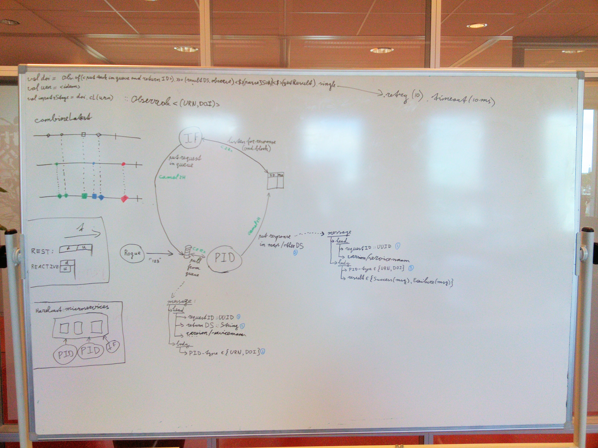

Hazelcast POC evaluatie
=======================

Inleiding
---------
In dit experiment kijken we wat de mogelijkheden zijn om Hazelcast te gebruiken in het werken met **microservices**. We willen naar een situatie toe waarin de 'monoliet' EASY omgevormd wordt naar een set van microservices die onafhankelijk van elkaar werken, die onafhankelijk van elkaar kunnen worden gedeployed/gereleased en die met elkaar samenwerken middels het sturen van messages/requests. Daarnaast zou het leuk zijn als we de services horizontaal kunnen schalen (meerdere instanties naast elkaar laten draaien om de workload te verdelen), hoewel dit geen directe requirement is in EASY.

**[Hazelcast]** (+ [boek]) biedt de mogelijkheid om een cluster op te zetten waarin **gedeelde in-memory datastructuren** leven. Denk hierbij aan `Map`, `Queue`, etc. Ieder **member** van dit cluster heeft toegang tot deze datastructuren en kan alle standaard operaties uitvoeren. Daarnaast heeft iedere member (een deel van) iedere datastructuur in zijn geheugen, zodat wanneer een member onverhoopt wegvalt er geen data verloren gaat.

Naast members biedt Hazelcast ook **clients**, die connectie maken naar het cluster van members en via hen dezelfde operaties kunnen doen op de datastructuren. Een client heeft dus zelf geen (kopie van de) datastructuren in-memory, maar kan ze alleen via het cluster bevragen/muteren/etc.

[Hazelcast]: https://hazelcast.org/
[boek]: https://github.com/rvanheest-DANS-KNAW/Hazelcast-experiments/blob/master/books/Mastering_Hazelcast_3.6.pdf

Project omschrijving
--------------------
Voor dit POC hebben we het project `easy-pid-generator` omgevormd naar een microservice. De keuze voor dit project in het bijzonder is een logische keuze, gegeven dat dit reeds een stand-alone microservice is die wordt aangeroepen via een REST interface. Aan dit project is dus nu een tweede microservice interface toegevoegd middels Hazelcast. Een queue (of inbox) wordt aangemaakt in het Hazelcast cluster en deze wordt gebruikt om requests van andere services te ontvangen. Een request wordt, zodra het in de queue zit en (een instantie van) `easy-pid-generator` beschikbaar is, uit de queue gehaald, geinterpreteerd en verwerkt. In deze context wordt òf een DOI òf een URN gegenereerd, afhankelijk van het request.

Een request is een `String` die een JSON document bevat. Deze heeft in de huidige vorm het volgende formaat:

  - head
    - requestID
    - responseDS
  - body
    - pidType

Hierin is de `requestID` een `UUID` die wordt gegenereerd door de *requester*. Deze wordt gebruikt om de response te markeren als het resultaat van deze request. De `responseDS` is de naam van de Hazelcast datastructuur (een `Map`) waarin de response wordt verwacht. Hierin is de `requestID` de key en de response zelf de value. De body bevat slechts het `pidType`, wat òf `urn` òf `doi` als waarde heeft.

Deze JSON wordt door `easy-pid-generator` geinterpreteerd en afgehandeld door een URN of een DOI te genereren. Vervolgens wordt op basis hiervan een response gegenereerd. Dit is opnieuw een JSON document in de vorm van een `String`. Dit heeft in de huidige vorm het volgende formaat:

  - head
    - requestID
  - body
    - pidType
    - result/error

Zoals hierboven genoemd wordt deze response samen met de `requestID` toegevoegd aan de `Map` aangeduidt met `responseDS`. In de response is in de header opnieuw de `requestID` te vinden, wat overeen komt met de `requestID` uit de request. Daarnaast is in de body ook het `pidType` te vinden, wat overeen komt met de `pidType` uit de request. Middels deze twee velden is het mogelijk voor de requester om te controleren dat de response overeen komt met wat er gevraagd werd. Daarnaast bevat de body òf een `result`, waarin de gevraagde URN of DOI is te vinden, òf een `error`, waarin de reden wordt medegedeeld waarom het gevraagde item niet kan worden opgevraagd.

In de huidige omstandigheden wordt `easy-pid-generator` alleen aangeroepen door `easy-ingest-flow`, welke afhankelijk van de deposit één of twee requests doet. Deze heeft een referentie naar de queue waarin `easy-pid-generator` zijn requests ontvangt en plaatst hierin de JSON `String` met het betreffende request. De `requestID` hierin wordt door `easy-ingest-flow` zelf gegenereerd en bewaard om in de `responseDS` te luisteren naar het **add-event** met `requestID` als key. Zodra de response ontvangen is, wordt deze gebruikt om het resultaat (de PID) hieruit te halen voor verder gebruik. Momenteel wordt in deze stap nog ***geen*** gebruik gemaakt van de mogelijkheid om te controleren dat de response behoort bij de ingestuurde request.

Het observeren van de queue en luisteren naar de `responseDS` wordt gedaan middels [RxJava]/[RxScala] om voor een eenvoudige manier van 'streaming data', concurrency handling en 'no blocking' te zorgen.

[RxJava]: https://github.com/ReactiveX/RxJava
[RxScala]: https://github.com/ReactiveX/RxScala

Evaluatie
---------
Hazelcast is een platform dat gedeelde datastructuren biedt tussen verschillende members en clients. In deze POC zijn `easy-ingest-flow` en `easy-pid-generator` clients die verbinding maken met het Hazelcast cluster dat aanwezig is op (d/t/a)easy. Dit is in overeenstemming met het design pattern dat wordt voorgesteld in de white paper ['Using Hazelcast with Microservices'].

Dit POC is succesvol afgerond en heeft geresulteerd in een werkend systeem dat interactie biedt tussen `easy-ingest-flow` en `easy-pid-generator`. Tijdens het proces zijn we tegen een aantal design decisions en open vragen aangelopen die we hieronder zullen bespreken.

['Using Hazelcast with Microservices']: https://github.com/rvanheest-DANS-KNAW/Hazelcast-experiments/blob/master/books/Microservices_with_Hazelcast.pdf

**Wat te doen met invalide JSON?**

Wanneer in de inbox van een microservice een `String` verschijnt met invalide JSON, kan dit op verschillende manieren fout zijn: (1) de JSON zelf is syntactisch niet juist en kan niet als zodanig worden geïnterpreteerd, (2) de JSON bevat onbekende of onvoldoende velden of (3) de waarden van de velden (bijvoorbeeld `pidType`) zijn onbekend. In alle gevallen kunnen we niet direct afleiden van wie dit request afkomstig is; dat is het gevolg van het in een queue zetten van een JSON message. Slechts in het derde geval zou er een mogelijkheid kunnen zijn om af te leiden waar de request van afkomstig is in het geval dat de `requestID` en `responseDS` *wel* valide zijn. In dat geval kan een response met een error worden gestuurd.

In deze POC hebben we ervoor gekozen om een simpele oplossing te kiezen waarin we alle invalide JSON weggooien en beschouwen als 'spam'. Dit betekent dat we in geen geval reageren op een invalide request en alleen valide JSON afhandelen. Zoals hierboven beargumenteerd kunnen we in de meeste gevallen niet anders!

Dit laatste is een nadeel van deze aanpak met Hazelcast. In een wereld waar REST wordt gebruikt als communicatie middel tussen services zou het reageren op foutieve input wel mogelijk zijn, omdat daar bekend is van wie de request afkomstig is.

**Public API**

De oplossing met Hazelcast zoals geformuleerd in deze POC is alleen te gebruiken wanneer een programma onderdeel uitmaakt of aangesloten is op het Hazelcast cluster. Het programma moet niet alleen weten in welke queue een bericht geplaatst moet worden, maar moet ook toegang hebben tot deze queue middels Hazelcast. Ook om een antwoord te verwachten moet het programma toegang hebben tot een map middels Hazelcast.

Het logische gevolg van dit ontwerp is dat de microservices niet publiek bereikbaar zijn. Er is geen publieke API gedefinieerd die de mogelijkheid biedt voor derden om gegevens uit te wisselen of op te vragen uit een microservice. Hiervoor moet een losse interface worden gedefinieerd, bijvoorbeeld middels REST.

We merken op dat in het geval van het ondersteunen van een *publieke* interface het hiervoor besproken punt betreffende invalide JSON des te zwaarder mee zal gaan wegen!

**Code duplication (common patterns)**

In deze POC hebben we op meerdere plaatsen code gedefinieerd die voor hergebruik in aanmerking komt. Dit betreft bijvoorbeeld het mechanisme om continue de queue/inbox te pollen of te luisteren naar add-events van een map en het omvormen van een JSON `String` naar een gerelateerde object structuur (en vise versa). Hieruit en uit andere herbruikbare code fragmenten die gerelateerd zijn aan de microservice architecture zou in de toekomst een library kunnen worden gevormd.

**Code duplication (JSON object structuren)**

Naast code duplication met common patterns onderscheiden we ook een stuk gedeelde code tussen verschillende services die *niet* voor een plaats in een library in aanmerking komen. Dit betreft voornamelijk de aan de JSON gerelateerde object structuren die het eenvoudiger maken om een JSON `String` te parsen en te gebruiken in de applicaties. Gezien zowel zender als ontvanger de notie van een request en een response hebben, en gezien deze data structuren gelijk zijn aan elkaar in de verschillende applicaties, kan de neiging ontstaan deze in een 'common library' onder te brengen. Dit wordt echter in de literatuur/talks over microservices ten stelligste afgeraden. Microservices zijn bedoeld om volledig onafhankelijk van elkaar te kunnen opereren. Het enige wat ze delen is een contract dat specificeert hoe de JSON moet worden ingedeeld. Het nadeel hiervan is dat in verschillende projecten dezelfde 'bean-classes' ontstaan, hoewel dit volledig in lijn is met het principe van 'loose coupling'.

**Load balancing**

De aanpak met het ontvangen van requests middels een queue als inbox heeft als groot voordeel dat er een automatische load balancing plaats vindt in het geval dat meerdere instanties van dezelfde microservice actief zijn. Gezien deze instanties uit dezelfde queue pollen, en gezien de policies die Hazelcast biedt zodat niet twee pollers hetzelfde element tegelijkertijd uit een queue kunnen halen, kan bij grote hoeveelheden requests een snellere afhandeling plaats vinden. Dit is een voordeel ten opzichte van bijvoorbeeld REST, waar een dergelijk iets eerst middels een losse load balancer moet worden geregeld.

Future work
-----------
Een aantal punten zijn in deze POC niet aan de orde gekomen of bewust open gelaten voor latere discussie. Deze worden in deze paragraaf kort toegelicht.

**Persistence**

In deze POC is ervoor gekozen om geen persistence van de requests en responses toe te voegen. Hazelcast biedt deze mogelijkheid echter wel op zijn datastructuren en wellicht dat hier in de toekomst ook gebruik van kan worden gemaakt.

**Validatie van de response op basis van de request**

In de huidige indeling van de response bieden we de mogelijkheid voor de requester om extra checks te doen dat de ontvangen response weldegelijk gerelateerd is aan de gestuurde request. Zoals eerder reeds is opgemerkt wordt dit door `easy-ingest-flow` op dit moment nog niet gedaan. Af te vragen valt of dit wel nodig en wenselijk is: de response is namelijk reeds gerelateerd aan de request middels de `requestID` in de `resultDS` map.

**Uitbreiden van de JSON**

Het is wenselijk om in de toekomst een versie nummer aan de header van de JSON toe te voegen, zodat onderscheid gemaakt kan worden tussen verschillende versies van de interface. Hierbij valt tevens te denken aan een routing module die de JSON requests naar de juiste versie van de service stuurt. Dit is tevens het geval voor de response, zodat de requester kan controleren dat hij je juiste versie van de JSON heeft ontvangen.

**Response Datastructure (garbage collection)**

De responses die in `responseDS` worden geplaatst, worden door de requester uitgelezen, maar worden op dit moment nog niet verwijderd. Er moet nog besloten worden of deze responses moeten worden weggegooid of gepersisteerd moeten worden en wie voor welke actie verantwoordelijk is. Is de requester zelf verantwoordelijk voor het opruimen van deze entries of moet dit worden gedaan door een externe 'garbage collector' module.

**Response Datastructure (shared)**

Hoewel dit niet getest is in deze POC, bestaat het vermoeden dat *alle responses van alle services* in een centrale `Map` kunnen worden geplaatst waar iedere requester naar luistert voor responses met een specifieke `requestID`. Bezien moet worden of dit mogelijk zijn en wat hiervan de voor- en nadelen zouden zijn. Hierbij moet ook de vraag gesteld worden of we hiermee niet tegen het idee van een microsystem architecture in gaan.

**Response Datastructure (no/invalid response)**

Hoe lang moet worden gewacht op de response van een microservice? Moet hiervoor een timeout worden gedefinieerd? En wat moet er gebeuren wanneer binnen een bepaald interval geen response komt. Opnieuw vragen (en zo ja, hoeveel keren) en/of afbreken met een foutmelding lijken juiste mogelijkheden. Hierbij moet ook rekening worden gehouden met mogelijke drukte en 'wachtrijen' bij sommige microservices.

Momenteel zijn deze details niet ingevuld in `easy-ingest-flow`. De service blijft oneindig lang wachten op een response.

Alternatieven/uitbreidingen
---------------------------
**Apache Camel**

Er zijn libraries en frameworks die voor bijvoorbeeld routing kunnen zorgen tussen verschillende microservices, message queues, ftp-clients, file systems, enz. [Apache Camel] lijkt hiervoor een uitstekende keuze. Dit zou mogelijk als een verbindingsstuk kunnen dienen tussen de verschillende microservices en/of tussen verschillende onderdelen van Hazelcast. Te denken valt hier bijvoorbeeld aan routing betreffende versies van de JSON naar verschillende versies van een microservice. In dit geval kan mogelijk de JSON beperkt blijven en hoeft geen versie nummer opgenomen te worden. Deze laatste kan dan in de Apache Camel message header. Daarnaast is er een goede integratie tussen [Hazelcast en Apache Camel] en [RxJava en Apache Camel] waarvan we gebruik zouden kunnen maken. Zie ook het [Camel in Action] boek.

[Apache Camel]: http://camel.apache.org/
[Hazelcast en Apache Camel]: http://camel.apache.org/hazelcast-component.html
[RxJava en Apache Camel]: http://camel.apache.org/rx.html
[Camel in Action]: https://github.com/rvanheest-DANS-KNAW/Hazelcast-experiments/blob/master/books/CamelInAction.pdf

**REST**

Een logische en traditionele manier van communicatie tussen microservices is een REST interface via HTTP. Hoewel het zeker nadelen heeft en dit zeker geen op zichzelf staande kant en klare oplossing is, worden een aantal van bovenstaande punten in 'Evaluatie' en 'Future work' automatisch opgelost met dit protocol.

**Scala actors**

Hoewel ik niet heel bekend ben met Scala's [Actor Framework] lijkt onze oplossing met Hazelcast hier zeer veel op. Ook hier is sprake van een inbox/queue waar messages in worden opgevangen en afgehandeld, waarna een response wordt teruggestuurd. Uit eerdere experimenten van @janvanmansum bleek echter dat het opzetten van dit framework vrij lastig is.

[Actor Framework]: http://akka.io/

Conclusie
---------
Hoewel deze POC een werkend prototype heeft opgeleverd zijn er nog flink wat open eindjes die besproken/opgelost moeten worden alvorens we een vervolg geven aan dit experiment. Los van alles staat dat EASY zeker omgeschreven moet worden naar een microservice architecture, zodat deployment, releases, enz., enz. sneller en efficienter kunnen gebeuren. 
